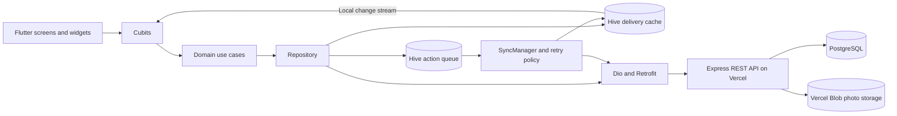
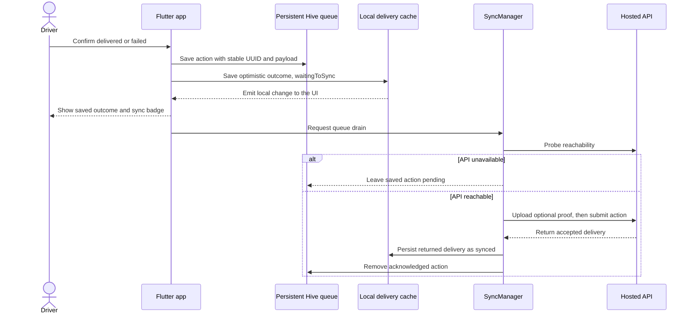

<p align="center">
  
</p>

<h1 align="center">Delivery Tracker</h1>
<p align="center"><strong>Keep delivering. Let the connection catch up.</strong></p>
<p align="center">Flutter mobile app · Durable offline queue · English & Arabic · Hosted REST API</p>

A driver should be able to finish a delivery even when the connection drops. Delivery Tracker saves the driver's action on the device first, shows its sync status, and sends it to the server when the API becomes reachable. Saved actions survive closing and reopening the app.

**The key demo:** load deliveries, disconnect, complete an order, close the app, reopen it offline, then reconnect and watch the queued update become synced.

| Explore | Link |
| --- | --- |
| Live API health | [Open hosted API](https://alshamel-delivery-api.vercel.app/) |
| Assigned deliveries | [View live JSON](https://alshamel-delivery-api.vercel.app/deliveries) |
| Mobile sync implementation | [PR #12](https://github.com/rajeh1032/delivery-tracker/pull/12) |
| Hosted backend implementation | [PR #11](https://github.com/rajeh1032/delivery-tracker/pull/11) |

## Demo video

> **Video slot** — add the recorded walkthrough here: online browsing → offline delivery → app restart → reconnect → synced confirmation.

<!-- Replace this slot with a public video URL. For a playable GitHub attachment,
     upload the recording through GitHub and paste its generated attachment URL here.
     Alternatively add: [Watch the demo](YOUR_PUBLIC_VIDEO_URL).
     Suggested length: 90–120 seconds. No video has been uploaded yet. -->

## App gallery

The following slots are ready for real app screenshots. English and Arabic captures show both the workflow and the RTL layout.

| Screen / State | English | Arabic · RTL |
| --- | --- | --- |
| Assigned deliveries: search, filters, status badges | Screenshot slot | Screenshot slot |
| Delivery details: customer, address, payment, location | Screenshot slot | Screenshot slot |
| Complete delivery: recipient, note, optional photo | Screenshot slot | Screenshot slot |
| Fail delivery: reason and optional note | Screenshot slot | Screenshot slot |
| Offline: saved action waiting to sync | Screenshot slot | Screenshot slot |
| Reopened app: pending update still visible | Screenshot slot | Screenshot slot |
| Recovery: synced confirmation or manual retry | Screenshot slot | Screenshot slot |

<!-- MEDIA INSERTION POINT
     Replace each "Screenshot slot" with an image, for example:
     
     Add actual captures under assets/screenshots/ or use GitHub attachment URLs.
     No screenshots are included yet; the existing icon above is an app asset.
-->

## What the driver can do

- Browse assigned deliveries, search the list, and filter by delivery status.
- Open customer and payment details, call the customer, and view a location preview when configured.
- Mark a delivery as delivered with a required recipient name, an optional note, and an optional photo.
- Mark a delivery as failed with a required reason and an optional note.
- Keep working with previously cached deliveries while offline.
- See separate delivery and synchronization statuses, and manually retry eligible failed updates.
- Switch between English and Arabic with directional layouts.

## Architecture at a glance



**Presentation** renders screens and handles user input through Cubits. **Domain** holds delivery entities, repository contracts, and use cases. **Data** implements the repository, local and remote data sources, DTOs, and mappers. Shared services manage connectivity, proof files, and synchronization; GetIt and Injectable connect the dependencies.

The mobile source is organized under `mobile/lib/features/delivery/`, with shared infrastructure under `mobile/lib/core/`. Hive uses handwritten adapters for the delivery cache and pending action queue.

**Reads:** the UI subscribes to local delivery changes, so cached records can appear while a remote load runs. The repository attempts remote reads, merges successful responses into the cache without discarding queued local changes, and falls back to cached records when the request fails. A first launch with no cache still needs connectivity to obtain deliveries.

**Writes:** delivery actions always enter local storage before synchronization. The UI distinguishes a delivery outcome such as `delivered` from its sync state such as `waitingToSync`.

## Offline-first: save first, sync second



Each action carries its original `client_action_id`, delivery ID, action type, payload, creation time, status, retry count, automatic retry eligibility, and next retry deadline. It is saved in `pending_actions_box`; delivery records live in `deliveries_box`.

The queue is ordered by creation time. A Future/Completer lock serializes drains so startup, reconnect, and manual retry cannot send actions concurrently from the same manager. Actions whose retry deadline has not arrived are skipped until eligible.

### What happens if the app is closed?

1. The driver confirms an action while offline. After its local writes complete, the action and visible delivery outcome are stored on disk.
2. Closing the app stops its in-process timers and network work. The Hive records and saved proof file remain on the device.
3. On reopening, the app opens Hive and reconciles cached sync badges that no longer have a queued action.
4. The sync manager starts listening and attempts a drain immediately. Offline work stays queued; reachable, eligible work can resume without a new user submission.
5. When connectivity returns, a debounced reconnect event triggers another drain. Persisted deadlines and retry counts prevent the restart from resetting the automatic retry budget.
6. After acceptance, the returned delivery is saved locally before the action is removed. If the server accepted a request but its response was lost, the next attempt uses the same UUID so the backend can replay the accepted result.

Synchronization runs while the app process is active. This implementation does not register an operating-system background worker to continue after force-closing the app. Device data clearing or uninstalling also removes its local queue.

### Retry and conflict behavior

| Situation | Behavior |
| --- | --- |
| API unreachable before an attempt | Keep the action; do not consume its retry budget. |
| Timeout, connection failure, or HTTP 5xx | Persist the failure and schedule another eligible attempt. |
| HTTP 429 | Respect `Retry-After` when supplied, including during manual retry. |
| Automatic retry budget exhausted | Keep the failed action visible; eligible manual retry starts a fresh budget with the same UUID. |
| Permanent rejection, such as validation failure or missing delivery | Retain failed state and disable resending the unchanged action. |
| HTTP 409 conflict | Fetch the current server delivery; after a successful refresh, save it and remove the conflicting action. If refresh fails, retain the action. |
| Server success followed by local cache write failure | Keep the action for recovery instead of dropping it before the result is safely cached. |

Automatic delivery attempts are bounded to **four total attempts**: the first send plus three retries. The base delays are **2, 4, and 8 seconds**, with up to 25% jitter. These deadlines are persisted, and the server's requested cooldown takes precedence when longer.

### Photo proof

The selected photo is copied into the app's documents directory under `proofs/`, and its local path is included in the queued action. Sync uploads the photo before submitting completion. After successful synchronization or conflict reconciliation, the local proof file is removed.

Completion and failure requests support idempotency. Photo uploads are separate and can repeat if a later completion attempt fails; the upload endpoint does not provide the same idempotency contract.

## Backend, explained simply

The backend is a small Express API with a delivery feature split into routes, validation, middleware, controllers, and storage. Joi checks action payloads, Multer handles multipart photos, and errors return JSON with a message and, where defined, a machine-readable code.

The hosted implementation runs on **Vercel**, uses **PostgreSQL** for delivery records and handled action responses, and stores hosted proof images in **Vercel Blob**. PostgreSQL transactions save the delivery change and its idempotency response together. Locks serialize matching action IDs and protect concurrent updates to a delivery.

Local development can use an in-memory store when `DATABASE_URL` is absent. That fallback resets with the server process; the hosted implementation requires database configuration for persistence.

> **Source status:** the hosted backend changes are in [PR #11](https://github.com/rajeh1032/delivery-tracker/pull/11). The backend explanation here describes that deployment implementation. Until it is merged, the backend on `dev` still uses the earlier in-memory implementation.

### Implemented endpoints

**Hosted base URL:** `https://alshamel-delivery-api.vercel.app`

| Method | Endpoint | Purpose | Successful response |
| --- | --- | --- | --- |
| GET | `/` | Check API availability | `200`, `{ "status": "online" }` |
| GET | `/deliveries` | Read assigned deliveries | `200`, delivery array |
| GET | `/deliveries/:id` | Read delivery details | `200`, delivery object |
| POST | `/deliveries/:id/complete` | Confirm successful delivery | `200`, message and delivery |
| POST | `/deliveries/:id/fail` | Record delivery failure | `200`, message and delivery |
| POST | `/deliveries/:id/proof` | Upload multipart field `photo` | `200`, message, `proof_url`, and delivery |

Completion requires `recipient_name` and `client_action_id`. Failure requires `reason` and `client_action_id`. Both accept optional `note` and `base_version`; the mobile client includes the version it acted on. Completion names are trimmed and limited to 2–100 characters; notes allow up to 500 characters. Hosted proof uploads are limited to 3 MiB.

**Duplicate protection:** repeating an accepted completion or failure UUID returns the stored result with `X-Idempotent-Replay: true`. Reusing that UUID for a different delivery returns `409` with `IDEMPOTENCY_KEY_REUSE`. A changed version or a delivery already finalized by another action returns `409` with `DELIVERY_CONFLICT`. Invalid payloads return `400`; missing deliveries return `404`.

## Run the app

Verified with **Flutter 3.44.4 / Dart 3.12.2**. The Dart SDK constraint in the project is `^3.12.2`.

```bash
cd mobile
cp env.example .env
flutter pub get
flutter run
```

The mobile client uses the hosted API by default. Configure a Google Maps key in `mobile/.env` if you want the map preview. The `.env` asset must exist even if you leave that integration unconfigured. Keep real keys out of Git.

To point an Android emulator at a locally running backend:

```bash
flutter run --dart-define=BASE_URL=http://10.0.2.2:3000
```

For an iOS simulator use `http://127.0.0.1:3000`; a physical device needs a reachable host address.

### Run the hosted backend implementation locally

Use the backend source from PR #11 for PostgreSQL and Blob support. Verified with **Node.js 24.18.0**.

```bash
cd backend
npm ci
cp .env.example .env
npm start
```

Leave `DATABASE_URL` empty for the in-memory local demo, or set it to a PostgreSQL connection string for persistent storage. Vercel uses `BLOB_STORE_ID` for its connected Blob store; `BLOB_READ_WRITE_TOKEN` supports token-based uploads. Local uploads without a Blob configuration are served under `/uploads/`.

## Verification

| Check | Result |
| --- | --- |
| Mobile static analysis | `flutter analyze`: no issues |
| Mobile automated suite | `flutter test`: 260 tests passed |
| Hosted backend branch tests | `npm test`: 7 Node tests and 33 API assertions passed |
| Live API read checks · September 30, 2026 | Health, list, and delivery details returned `200`; unknown delivery returned `404`; list contained 40 records |

The tests cover local queue persistence, legacy storage decoding, retry timing and cooldowns, restart scheduling, stable action IDs, serialized synchronization, conflict recovery, proof retention, refresh behavior, manual retry, screen states, and Arabic layouts. Persistence tests reopen local storage; they are distinct from a recorded force-close demonstration on a device.

### Suggested video walkthrough

1. Show the delivery list and open an order's details.
2. Switch to Arabic briefly to show the RTL layout.
3. Disconnect the device and complete a pending delivery with a recipient name and optional proof.
4. Show the waiting-to-sync badge, then close and reopen the app while still offline.
5. Show that the delivery update is still present. Reconnect and wait for synchronization.
6. Show the synced badge and the updated server record. If demonstrating a retryable failure, use the manual retry action to recover it.

Use a pending demo delivery: completing or failing an order changes the shared hosted data. The demo API has no driver authentication or assignment filtering; it serves its seeded delivery dataset.
